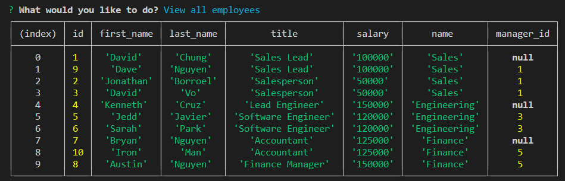
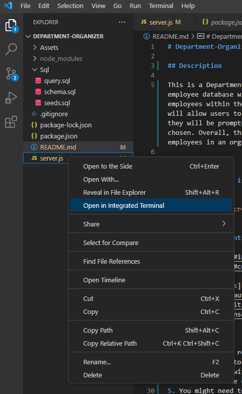
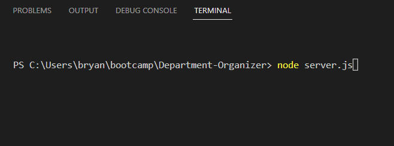
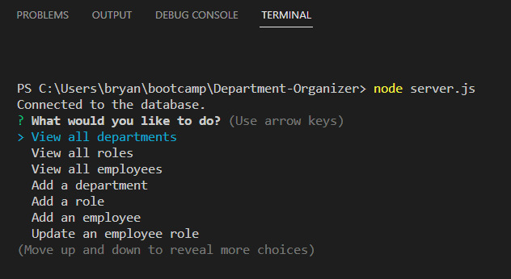
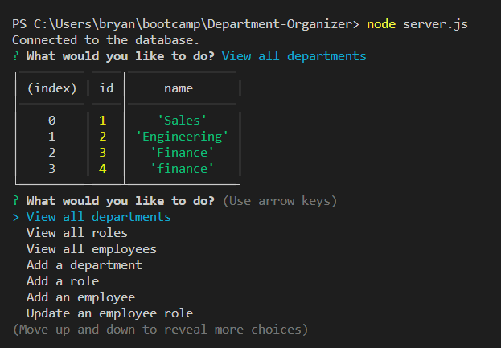
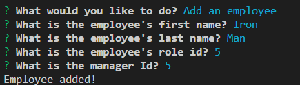

# Department-Organizer

## Description 

This is a Department Organizer, this is a tool for companies to organize their employee database with different departments and their respective roles and employees within them. Users will get prompted with questions using node.js that will allow users to choose from the user menu. Once they have selected an option they will be prompted using inquirer prompt or a SQL query based on the option chosen. Overall, this application will allow companies to keep track of their employees in an organized SQL database fashion.

## Mock-Up

### Here is a video link showing the usage of the application:
[Department Organizer Demo](https://drive.google.com/file/d/1WZ8jvRN8YxQ_jqrn9lehCCIbXP2DIvzY/view?pli=1)

### The following is an example output of the Department Organizer view all:



## Table of Contents

* [Installation](#installation)
* [Code Example](#code-example)
* [Usage](#usage)
* [Learning Points](#learning-points)
* [Author Info](#author-info)
* [Credits](#credits)
* [License](#license)

## Installation

1. Clone down the repository or download all files within repository
2. You will need to install node.js
3. Open terminal within VS Code and type 'node server.js'
4. Select from the user menu as you wish
5. You might need to install these packages: inquirer, mysql2

```
npm i inquirer@8.2.4

npm i mysql2
```

## Code Example

Here is an example of my addEmployee function that allows users to add a new employee with different inputs: First name, Last name, role ID, and if they have a manager ID or not.

addEmployee:
```javascript
const addEmployee = () => {
  inquirer.prompt([
      {
        name: 'firstName',
        type: 'input',
        message: "What is the employee's first name?",
      },
      {
        name: 'lastName',
        type: 'input',
        message: "What is the employee's last name?",
      },
      {
        name: 'roleId',
        type: 'input',
        message: "What is the employee's role id?",
      },
      {
        name: 'managerId',
        type: 'input',
        message: 'What is the manager Id?',
      },
    ])
    .then(answer => {
      db.query(
        'INSERT INTO employee (first_name, last_name, role_id, manager_id) VALUES (?, ?, ?, ?)',
        [answer.firstName, answer.lastName, answer.roleId, answer.managerId],
        function (err, res) {
          if (err) throw err;
          console.log('Employee added!');
          userMenu();
        }
      );
    });
};
```

## Usage

### Here is a video link showing the usage of the application:
[Department Organizer Demo](https://drive.google.com/file/d/1WZ8jvRN8YxQ_jqrn9lehCCIbXP2DIvzY/view?pli=1)

### Here you can see how I access the terminal within VS Code:



### Here you can see what I input into the terminal to initalize the application:



### Here you can see the user menu list the user can then choose from:



### Here is an example of what can be an expected output from one of the options:



### Here is an example of what adding an employee would look like:



### Here you can see the output of view all Employees after an updated employee:


## Learning Points 

This project taught me a lot and solidified my knowledge of node.js as well as using the inquirer package. It provided me with different use cases of mySQL within javascript functionalities and applications. I believe that after this project I now am knowledgeable within mySQL and using the mysql2 package within javascript in order to query right into javascript. There was not very many stopping points for me but definitely more to improve on in the future. I want more user prompted criteria so if users want to make adjustments to certain salaries, or specific searches of employees or roles they are able to do that as well.

## About Me

Hi, my name is Bryan Nguyen I am an up and coming full-stack web developer working
on getting into the space with projects that support both my growth, belief, and imagination. I hope to one day work within the realm of AI, web-development, and even site-reliability/cyber-security.

## My links

### * [Portfolio](https://bryannguyen9.github.io/Bryan-Nguyen-Portfolio/)
### * [LinkedIn](https://linkedin.com/in/bryannguyen9)
### * [Github](https://github.com/bryannguyen9)


## Credits

### Special thanks to David Chung: 
 
- [David Chung's Github](https://github.com/dchung13/)
- [David Chung's LinkedIn](https://www.linkedin.com/in/david-chung-77141526b/)
- [David Chung's Portfolio](https://dchung13.github.io/David-Chung-Portfolio/) 

### Special thanks to David Vo:

- [David Vo's Github](https://github.com/daevidvo)
- [David Vo's LinkedIn](https://www.linkedin.com/in/daevidvo/)

### Special thanks to these reference websites that taught me different functionalities within my website for me to create a seamless experience for users.

1. [Stack Overflow](https://stackoverflow.com/questions/64220107/passing-sql-queries-into-inquirer-prompt)
2. [NpmJS for mysql2](https://www.npmjs.com/package/mysql2)
3. [NpmJS for inquirer](https://www.npmjs.com/package/inquirer)

## License
[](https://opensource.org/licenses/MIT)

This project is licensed under the MIT License.

MIT License

    Copyright (c) [2023] [Bryan Nguyen]
    
    Permission is hereby granted, free of charge, to any person obtaining a copy
    of this software and associated documentation files (the "Software"), to deal
    in the Software without restriction, including without limitation the rights
    to use, copy, modify, merge, publish, distribute, sublicense, and/or sell
    copies of the Software, and to permit persons to whom the Software is
    furnished to do so, subject to the following conditions:
    
    The above copyright notice and this permission notice shall be included in all
    copies or substantial portions of the Software.
    
    THE SOFTWARE IS PROVIDED "AS IS", WITHOUT WARRANTY OF ANY KIND, EXPRESS OR
    IMPLIED, INCLUDING BUT NOT LIMITED TO THE WARRANTIES OF MERCHANTABILITY,
    FITNESS FOR A PARTICULAR PURPOSE AND NONINFRINGEMENT. IN NO EVENT SHALL THE
    AUTHORS OR COPYRIGHT HOLDERS BE LIABLE FOR ANY CLAIM, DAMAGES OR OTHER
    LIABILITY, WHETHER IN AN ACTION OF CONTRACT, TORT OR OTHERWISE, ARISING FROM,
    OUT OF OR IN CONNECTION WITH THE SOFTWARE OR THE USE OR OTHER DEALINGS IN THE
    SOFTWARE.

For further details on the MIT License you can click on this link: [Link to MIT License Details](https://opensource.org/license/mit/)


